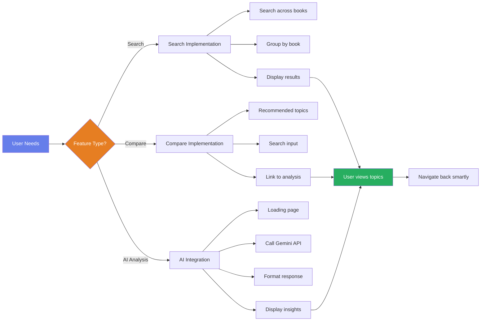
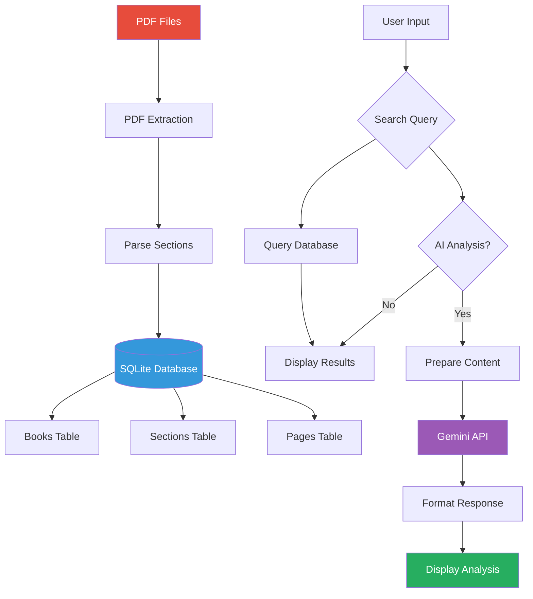
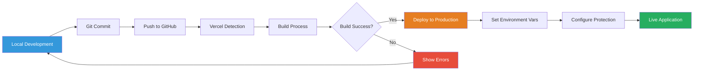
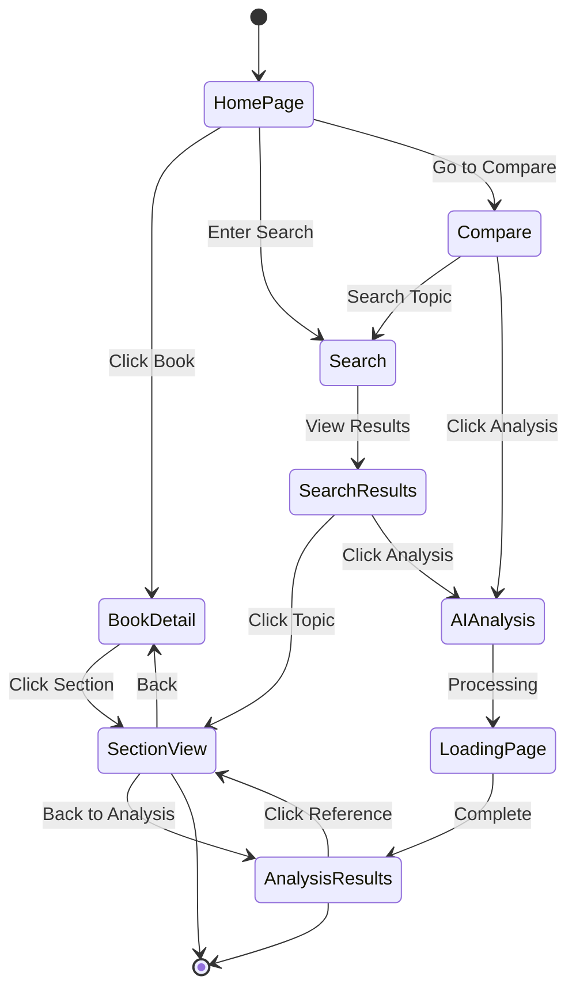

# PM Framework Analyzer - WBS Flowchart

```mermaid
flowchart TD
    Start([PM Framework Analyzer Project]) --> Init[1. PROJECT INITIATION]
    Start --> Design[2. SYSTEM DESIGN]
    Start --> Backend[3. BACKEND DEVELOPMENT]
    Start --> Frontend[4. FRONTEND DEVELOPMENT]
    Start --> Features[5. FEATURE IMPLEMENTATION]
    Start --> Testing[6. TESTING]
    Start --> Deploy[7. DEPLOYMENT]
    Start --> Docs[8. DOCUMENTATION]
    Start --> QA[9. QUALITY ASSURANCE]
    Start --> Maintain[10. MAINTENANCE]

    Init --> Init1[1.1 Requirements Gathering]
    Init --> Init2[1.2 Project Planning]
    Init1 --> Init11[Define scope & objectives]
    Init1 --> Init12[Identify stakeholder requirements]
    Init2 --> Init21[Create timeline]
    Init2 --> Init22[Identify technologies]

    Design --> Design1[2.1 Architecture Design]
    Design --> Design2[2.2 UI Design]
    Design --> Design3[2.3 Data Flow Design]
    Design1 --> Design11[Database schema]
    Design1 --> Design12[Django MVC architecture]
    Design1 --> Design13[API integration]
    Design2 --> Design21[Wireframes & mockups]
    Design2 --> Design22[Navigation flow]
    Design3 --> Design31[PDF extraction workflow]
    Design3 --> Design32[Search & filter logic]

    Backend --> Backend1[3.1 Django Setup]
    Backend --> Backend2[3.2 Database Development]
    Backend --> Backend3[3.3 PDF Processing]
    Backend --> Backend4[3.4 Data Import Commands]
    Backend --> Backend5[3.5 Business Logic]
    Backend --> Backend6[3.6 AI Integration]
    
    Backend2 --> Backend21[Create Book model]
    Backend2 --> Backend22[Create Section model]
    Backend2 --> Backend23[Create Page model]
    Backend2 --> Backend24[Database migrations]
    
    Backend3 --> Backend31[PDF text extraction]
    Backend3 --> Backend32[Section detection]
    Backend3 --> Backend33[Page-to-section mapping]
    
    Backend4 --> Backend41[import_iso21500]
    Backend4 --> Backend42[import_iso21502]
    Backend4 --> Backend43[import_prince2]
    Backend4 --> Backend44[import_pmbok]
    
    Backend6 --> Backend61[Setup Gemini API]
    Backend6 --> Backend62[Design AI prompts]
    Backend6 --> Backend63[Response parsing]
    Backend6 --> Backend64[Markdown formatter]

    Frontend --> Frontend1[4.1 Template Development]
    Frontend --> Frontend2[4.2 Styling & UI]
    Frontend --> Frontend3[4.3 Interactive Features]
    Frontend --> Frontend4[4.4 Accessibility]
    
    Frontend1 --> Frontend11[Base template]
    Frontend1 --> Frontend12[Index page]
    Frontend1 --> Frontend13[Book detail page]
    Frontend1 --> Frontend14[Section detail]
    Frontend1 --> Frontend15[Search results]
    Frontend1 --> Frontend16[Compare page]
    Frontend1 --> Frontend17[Analysis loading]
    Frontend1 --> Frontend18[Analysis results]
    
    Frontend2 --> Frontend21[Gradient design]
    Frontend2 --> Frontend22[Card layouts]
    Frontend2 --> Frontend23[Responsive design]

    Features --> Features1[5.1 Book Management]
    Features --> Features2[5.2 Search Functionality]
    Features --> Features3[5.3 Compare Feature]
    Features --> Features4[5.4 AI Analysis]
    Features --> Features5[5.5 Navigation System]
    
    Features4 --> Features41[Loading page]
    Features4 --> Features42[Generate analysis]
    Features4 --> Features43[Format output]
    Features4 --> Features44[Display similarities]
    Features4 --> Features45[Display differences]
    Features4 --> Features46[Display unique points]

    Testing --> Testing1[6.1 Unit Testing]
    Testing --> Testing2[6.2 Integration Testing]
    Testing --> Testing3[6.3 User Acceptance Testing]
    Testing --> Testing4[6.4 Browser Testing]
    
    Testing4 --> Testing41[Chrome]
    Testing4 --> Testing42[Firefox]
    Testing4 --> Testing43[Safari]
    Testing4 --> Testing44[Edge]

    Deploy --> Deploy1[7.1 Environment Config]
    Deploy --> Deploy2[7.2 Security Implementation]
    Deploy --> Deploy3[7.3 Vercel Configuration]
    Deploy --> Deploy4[7.4 Database Preparation]
    Deploy --> Deploy5[7.5 Deployment Execution]
    Deploy --> Deploy6[7.6 Post-Deployment]
    
    Deploy4 --> Deploy41[Run migrations]
    Deploy4 --> Deploy42[Import ISO 21500]
    Deploy4 --> Deploy43[Import ISO 21502]
    Deploy4 --> Deploy44[Import PRINCE2]
    Deploy4 --> Deploy45[Import PMBOK]
    
    Deploy5 --> Deploy51[Install Vercel CLI]
    Deploy5 --> Deploy52[Authenticate]
    Deploy5 --> Deploy53[Deploy to production]
    Deploy5 --> Deploy54[Set env variables]

    Docs --> Docs1[8.1 Technical Documentation]
    Docs --> Docs2[8.2 User Documentation]
    Docs --> Docs3[8.3 Project Documentation]
    
    Docs1 --> Docs11[README.md]
    Docs1 --> Docs12[Code comments]
    Docs3 --> Docs31[WBS.md]
    Docs3 --> Docs32[WBS Flowchart]

    QA --> QA1[9.1 Code Quality]
    QA --> QA2[9.2 Performance Optimization]
    QA --> QA3[9.3 Security Audit]
    
    QA1 --> QA11[Code review]
    QA1 --> QA12[PEP 8 compliance]
    QA2 --> QA21[Database indexing]
    QA2 --> QA22[Query optimization]

    Maintain --> Maintain1[10.1 Monitoring]
    Maintain --> Maintain2[10.2 Updates & Enhancements]
    Maintain --> Maintain3[10.3 Backup & Recovery]
    
    Maintain1 --> Maintain11[Error tracking]
    Maintain1 --> Maintain12[Monitor API usage]
    Maintain2 --> Maintain21[Framework updates]
    Maintain2 --> Maintain22[Feature enhancements]

    Deploy6 --> Complete([Project Complete])
    Docs3 --> Complete
    QA3 --> Complete
    
    style Start fill:#667eea,stroke:#764ba2,stroke-width:4px,color:#fff
    style Complete fill:#27ae60,stroke:#229954,stroke-width:4px,color:#fff
    style Init fill:#e8eaf6,stroke:#667eea
    style Design fill:#e8eaf6,stroke:#667eea
    style Backend fill:#e8eaf6,stroke:#667eea
    style Frontend fill:#e8eaf6,stroke:#667eea
    style Features fill:#e8eaf6,stroke:#667eea
    style Testing fill:#e8eaf6,stroke:#667eea
    style Deploy fill:#e8eaf6,stroke:#667eea
    style Docs fill:#e8eaf6,stroke:#667eea
    style QA fill:#e8eaf6,stroke:#667eea
    style Maintain fill:#e8eaf6,stroke:#667eea
```

## Simplified Project Flow

## Feature Development Flow

## Data Flow Diagram

## Deployment Pipeline

## Usage Flow

---

## How to View These Diagrams

These flowcharts use Mermaid syntax. To view them:

1. **GitHub**: Automatically renders on GitHub when you view this file
2. **VS Code**: Install "Markdown Preview Mermaid Support" extension
3. **Online**: Copy the mermaid code to https://mermaid.live/
4. **Export**: Use mermaid.live to export as PNG, SVG, or PDF

---

**Created:** October 5, 2025  
**Project:** PM Framework Analyzer  
**Version:** 1.0
