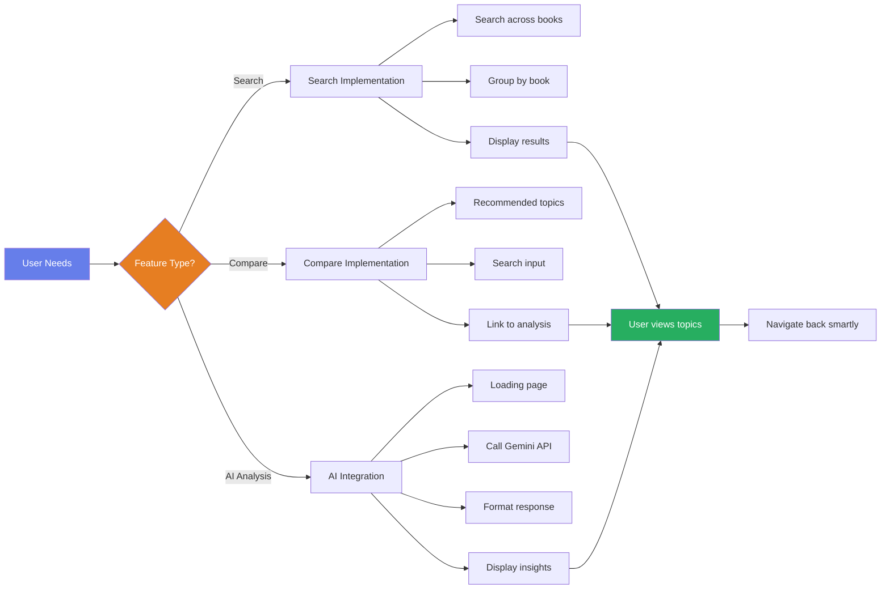
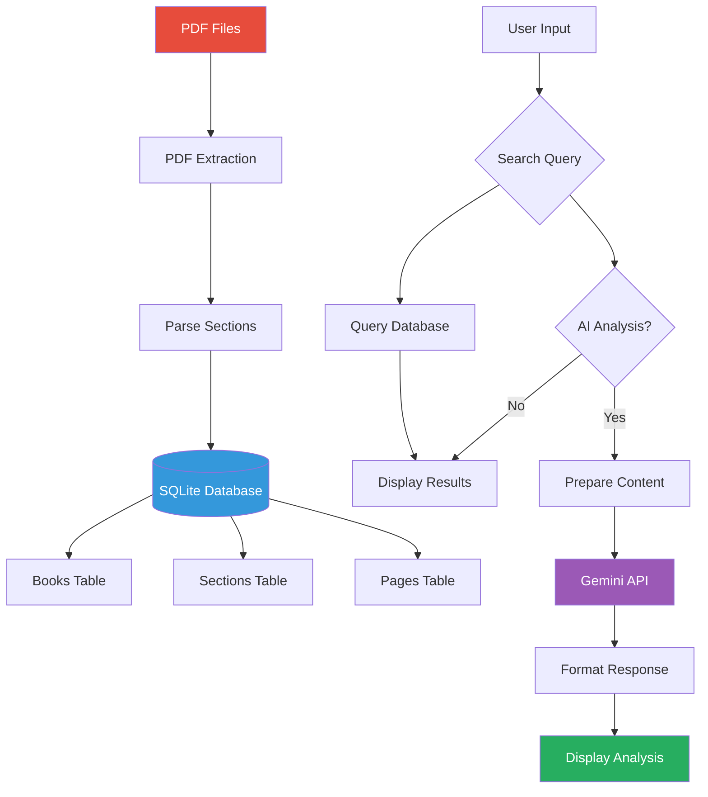
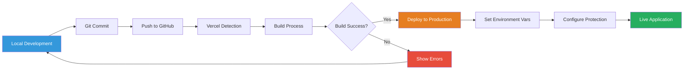
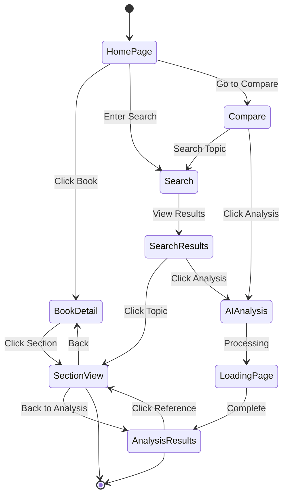

# PM Framework Analyzer - WBS Flowchart

## Work Breakdown Structure - Visual Flow

This flowchart represents the complete Work Breakdown Structure for the PM Framework Analyzer project, organized in a hierarchical top-to-bottom flow.

## Flowchart Legend

### Node Types
- **Oval Shapes**: Project start and completion milestones
- **Rectangles**: Work packages and tasks
- **Rounded Rectangles**: Phase groupings

### Color Coding
- **Purple Gradient**: Project boundaries (Start/Complete)
- **Light Purple**: Phase 1 - Planning & Design
- **Light Orange**: Phase 2 - Development
- **Light Blue**: Phase 3 - Quality & Deployment
- **Green**: Project completion

### Project Phases

**Phase 1: Planning & Design**
- Project Initiation
- System Design

**Phase 2: Development**
- Backend Development
- Frontend Development
- Feature Implementation

**Phase 3: Quality & Deployment**
- Testing
- Deployment
- Documentation
- Quality Assurance
- Maintenance & Support

### Project Metrics
- **Total Work Packages**: 10 major phases
- **Total Tasks**: 200+ individual tasks
- **Total Sections Imported**: 667 sections
- **PM Standards Covered**: 4 (ISO 21500, ISO 21502, PRINCE2, PMBOK)
- **Development Approach**: Agile/Iterative

**Last Updated**: October 5, 2025  
**Project Status**: COMPLETED AND DEPLOYED

---

## Simplified Project Flow

## Feature Development Flow

## Data Flow Diagram

## Deployment Pipeline

## Usage Flow

---

## How to View These Diagrams

These flowcharts use Mermaid syntax. To view them:

1. **GitHub**: Automatically renders on GitHub when you view this file
2. **VS Code**: Install "Markdown Preview Mermaid Support" extension
3. **Online**: Copy the mermaid code to https://mermaid.live/
4. **Export**: Use mermaid.live to export as PNG, SVG, or PDF

---

**Created:** October 5, 2025  
**Project:** PM Framework Analyzer  
**Version:** 1.0

## Simplified Project Flow

## Feature Development Flow

## Data Flow Diagram

## Deployment Pipeline

## Usage Flow

---

## How to View These Diagrams

These flowcharts use Mermaid syntax. To view them:

1. **GitHub**: Automatically renders on GitHub when you view this file
2. **VS Code**: Install "Markdown Preview Mermaid Support" extension
3. **Online**: Copy the mermaid code to https://mermaid.live/
4. **Export**: Use mermaid.live to export as PNG, SVG, or PDF

---

**Created:** October 5, 2025  
**Project:** PM Framework Analyzer  
**Version:** 1.0
