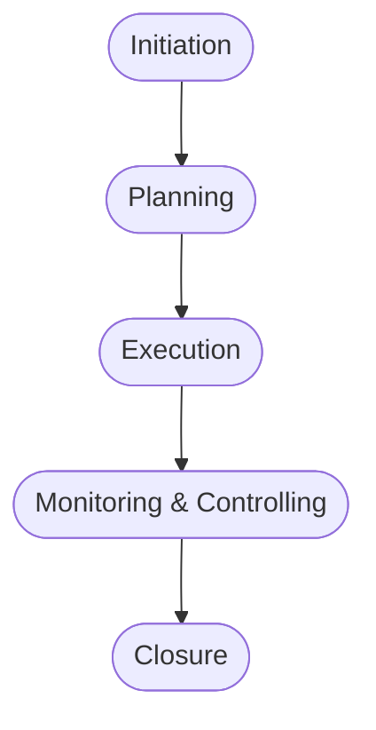

# Process Design Document

A structured report containing:

- **Proposed processes for the three project scenarios**
- **Justification and references to standards**
- **Process diagrams (workflow/phase models)**

---

## 1. Proposed Processes for Project Scenarios

### Scenario 1: Government Infrastructure Project Management Process

**Process Overview:**
This process provides a structured framework for managing a large, multi-disciplinary government infrastructure project, ensuring governance, compliance, and successful delivery.

**Approach:**
PRINCE2 is used as the primary methodology, adapted for government compliance requirements, due to its emphasis on structured organization, defined roles and responsibilities, and control at each stage, enhanced with elements from PMBOK and ISO standards for specific knowledge areas. This hybrid approach offers a robust yet flexible framework suitable for a complex government project.

**Phases:**
- **Initiation (3 months)**
  - Objective: Define project scope, objectives, and establish governance structure.
  - Key Activities: Develop Project Brief, conduct Stakeholder Analysis.
  - Deliverables: Project Initiation Document (PID), Stakeholder Register.
  - Decision Gate: Project Approval, criteria: PID sign-off by Steering Committee.
  - Reference: PRINCE2 Starting Up a Project

- **Planning (3 months)**
  - Objective: Create detailed plans for all project aspects including schedule, budget, resources, and risk.
  - Key Activities: Develop detailed Work Breakdown Structure (WBS), Risk Management Plan.
  - Deliverables: Project Management Plan, Risk Register.
  - Decision Gate: Plan Approval, criteria: PMP sign-off by Project Board.
  - Reference: PRINCE2 Initiating a Project

- **Execution (15 months)**
  - Objective: Execute the project plan, manage resources, and deliver project outputs.
  - Key Activities: Civil, Electrical, and IT workstream execution, Procurement management.
  - Deliverables: Construction progress reports, Software deliverables.
  - Decision Gate: Stage Gate Reviews (quarterly), criteria: Milestones achieved, budget adherence.
  - Reference: PRINCE2 Controlling a Stage

- **Monitoring & Controlling (Ongoing)**
  - Objective: Track project progress, manage risks, and ensure compliance with requirements.
  - Key Activities: Performance reporting, Change Management.
  - Deliverables: Weekly status reports, Change requests.
  - Decision Gate: Exception Assessment, criteria: Significant deviations from plan require immediate action.
  - Reference: PMBOK p.365

- **Closure (3 months)**
  - Objective: Formally close the project, document lessons learned, and handover deliverables.
  - Key Activities: Final project reporting, Handover to operations.
  - Deliverables: Project Closure Report, As-built documentation.
  - Decision Gate: Project Closure Approval, criteria: All deliverables accepted, final audit completed.
  - Reference: PRINCE2 Closing a Project

**Critical Roles:**
- Project Director: Provides overall strategic direction and ensures alignment with government objectives.
- Project Manager: Manages day-to-day project activities, risks, and resources.
- Technical Leads (Civil, Electrical, IT): Responsible for the technical delivery of their respective workstreams.
- Quality Assurance Manager: Ensures compliance with quality standards and regulatory requirements.
- Procurement Manager: Manages all procurement activities in accordance with government regulations.

**Tailoring Rationale:**
- Emphasis on PRINCE2 governance structures to align with government oversight and accountability.
- Inclusion of a dedicated Quality Assurance role to ensure strict adherence to regulatory compliance requirements specific to government projects.
- Procurement Management is highlighted as a critical area given the public sector context, focusing on compliance with procurement regulations.
- Stage gate reviews increased to quarterly to provide more frequent performance evaluations and oversight.

---

### Scenario 2: Agile Innovation Project Management

**Approach:**
An iterative and incremental Agile approach (specifically Scrum) is best, allowing for rapid experimentation, adaptation to evolving understanding, and continuous stakeholder feedback given the inherent uncertainty of the innovation project. This is supported by PMBOK's focus on value delivery (PMBOK p.42).

**Phases:**
- **Envision (1 Month)**
  - Objective: Define the problem, desired outcomes, and high-level solution concept.
  - Key Activities: Conduct user research, define initial product vision.
  - Deliverables: Product Vision Document, Initial Product Backlog.
  - Decision Gate: Concept Approval - Validate alignment with strategic goals and market potential.
  - Reference: ISO 21500, 5.2 Context establishment.

- **Experimentation (3 Months)**
  - Objective: Rapidly prototype and test key assumptions and technical feasibility.
  - Key Activities: Build Minimum Viable Products (MVPs), Conduct user testing and gather feedback.
  - Deliverables: Working prototypes, User feedback reports.
  - Decision Gate: Prototype Validation - Confirm feasibility and potential based on user data.
  - Reference: PMBOK p.58 (Focus on experimentation in agile approaches)

- **Development (6 Months)**
  - Objective: Develop a fully functional product based on validated prototypes.
  - Key Activities: Sprint-based development, continuous integration and testing.
  - Deliverables: Potentially shippable product increments, Release documentation.
  - Decision Gate: Release Readiness - Verify product meets defined quality criteria and user needs.
  - Reference: PRINCE2, Managing Product Delivery

- **Launch & Learn (2 Months)**
  - Objective: Release the product to a limited market and gather real-world feedback for future iterations.
  - Key Activities: Beta testing or early access release, Monitor user behavior and gather feedback.
  - Deliverables: Initial product release, User feedback analysis report.
  - Decision Gate: Market Validation - Determine product-market fit and plan for future development.
  - Reference: ISO 21502, 9.5.4 Benefits Management

**Critical Roles:**
- Product Owner: Defines and prioritizes the product backlog based on market needs.
- Scrum Master: Facilitates the Scrum process and removes impediments.
- Development Team: Builds and tests the product increments.

**Tailoring Rationale:**
- Shorter Iterations: Reduce Sprint length (e.g., 1-2 weeks) to maximize responsiveness to rapid experimentation cycles.
- Adaptive Planning: Focus on rolling wave planning, detailing only the near-term Sprints in depth due to uncertainty (PMBOK p. 29).
- Dedicated Innovation Budget: Allocate contingency budget explicitly for unforeseen experimental costs.
- Stakeholder Involvement: Frequent demonstrations and feedback sessions to keep stakeholders informed of progress and adapt to changing requirements (ISO 21502, 9.4.2 Stakeholder Engagement).

---

### Scenario 3: Agile-Iterative Project Management Process

**Approach:**
Agile Scrum methodology is best suited for well-defined requirements, short duration, and small team size, providing rapid iteration and adaptation to evolving needs. This will be supplemented by PMBOK's principles.

**Phases:**
- **Inception (1 week)**
  - Objective: Establish project vision and sprint zero.
  - Key Activities: Define high-level scope, backlog creation.
  - Deliverables: Project charter, initial product backlog.
  - Decision Gate: Project Approval – Stakeholder alignment on project goals.
  - Reference: PMBOK p.77, principle "Engage Stakeholders"

- **Sprint Planning (Ongoing, before each sprint)**
  - Objective: Plan sprint goals and tasks.
  - Key Activities: Prioritize backlog items, assign tasks.
  - Deliverables: Sprint backlog, sprint goal.
  - Decision Gate: Sprint Start – Team commitment to sprint backlog.
  - Reference: Agile Guide

- **Development (Iterative, 1-2 week sprints)**
  - Objective: Develop and test software increments.
  - Key Activities: Code, test, integrate software features.
  - Deliverables: Working software increments.
  - Decision Gate: Sprint Review – Demonstrated working software.
  - Reference: Agile Guide

- **Review & Adaptation (Weekly)**
  - Objective: Gather feedback and adjust development.
  - Key Activities: Conduct sprint review, gather feedback, refine backlog.
  - Deliverables: Sprint review report, updated product backlog.
  - Decision Gate: Next Sprint Planning – Integration of feedback.
  - Reference: Agile Guide

- **Deployment (Final Sprint)**
  - Objective: Deliver the final product.
  - Key Activities: Final testing, deployment, user training.
  - Deliverables: Deployed software, user documentation.
  - Decision Gate: Project Closure – Stakeholder acceptance of final product.
  - Reference: PMBOK p.25, section on project closure

**Critical Roles:**
- Product Owner: Manages the product backlog and represents stakeholders.
- Scrum Master: Facilitates the Scrum process and removes impediments.
- Development Team: Develops and tests software features.

**Tailoring Rationale:**
- Reduced Documentation: Focus on working software over extensive documentation, aligning with Agile principles.
- Timeboxing: Strict adherence to sprint lengths to maintain pace and efficiency.
- Daily Stand-ups: Emphasizing communication and quick problem-solving.
- Integrated Testing: Continuous testing throughout development to ensure quality in a fast-paced environment.

---

## 2. Justification and References to Standards

Each process is tailored to the scenario context and references industry standards:

- **Government Infrastructure Project:**
  - PRINCE2 for governance and control, PMBOK for monitoring/controlling, ISO for compliance.
  - References: PRINCE2 (Starting Up a Project, Initiating a Project, Controlling a Stage, Closing a Project), PMBOK p.365, ISO 21500/21502.

- **Agile Innovation Project:**
  - Scrum for iterative development, PMBOK for value delivery, ISO for context and benefits management.
  - References: ISO 21500 5.2, PMBOK p.42, p.58, PRINCE2 Managing Product Delivery, ISO 21502 9.5.4, 9.4.2.

- **Agile-Iterative Project:**
  - Scrum for rapid iteration, PMBOK for stakeholder engagement and closure.
  - References: PMBOK p.77, p.25, Agile Guide.

---

## 3. Process Diagrams (Workflow/Phase Models)

Diagrams for each scenario can be created using Mermaid.js, draw.io, or similar tools. Example Mermaid syntax for Scenario 1:

---

*This document summarizes the process designs, justifications, references, and diagrams for three project scenarios as discussed.*
